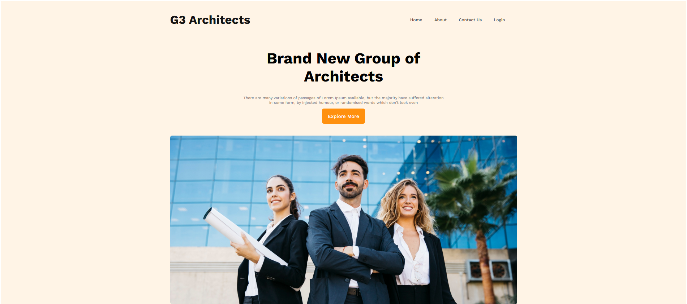

# 🎉 G3 Architects Resources

G3 Architects Resources is a modern, fully responsive website designed for architecture firms, studios, and professionals. The site features a clean layout, engaging visuals, and a user-friendly interface to showcase teams, features, achievements, and sponsors.

## 🚀 Live Demo
[View on GitHub Pages](https://shariar-ahamed.github.io/Architects_Resources/)

---

## 📸 Screenshot



---

## ✨ Features

- Fully responsive design for all devices
- Modern and clean UI/UX
- Team showcase section
- Features and highlights section
- Company facts and achievements
- Sponsors/partners display
- Smooth navigation and call-to-action buttons

---

## 🛠️ Technologies Used

- HTML5
- CSS3 (Flexbox, Grid, Media Queries)
- Google Fonts (Work Sans)

---

## 📂 Project Structure

```
├── index.html
├── style.css
├── Web_Screenshot.png
├── images/
│   ├── architect.png
│   ├── banner.png
│   ├── team1.png
│   ├── team2.png
│   ├── team3.png
│   ├── team4.png
│   └── icons/
│       ├── customers.png
│       ├── email.png
│       ├── projects.png
│       └── ribon.png
│   └── sponsors/
│       ├── amazon.png
│       ├── figma.png
│       ├── google.png
│       ├── spotify.png
│       └── telerama.png
```

---

## 📱 Responsive Design

The website is fully responsive and adapts seamlessly to mobile, tablet, and desktop screens using CSS Flexbox, Grid, and media queries.

---

## ⚡ Getting Started

1. **Clone the repository:**
   ```bash
   git clone https://github.com/shariar-ahamed/Architects_Resources.git
   ```
2. **Open `index.html` in your browser.**

---

## 🙌 Credits

- Designed and developed by [shariar-ahamed](https://github.com/shariar-ahamed)

---

## 📄 License

This project is licensed for educational and personal use.